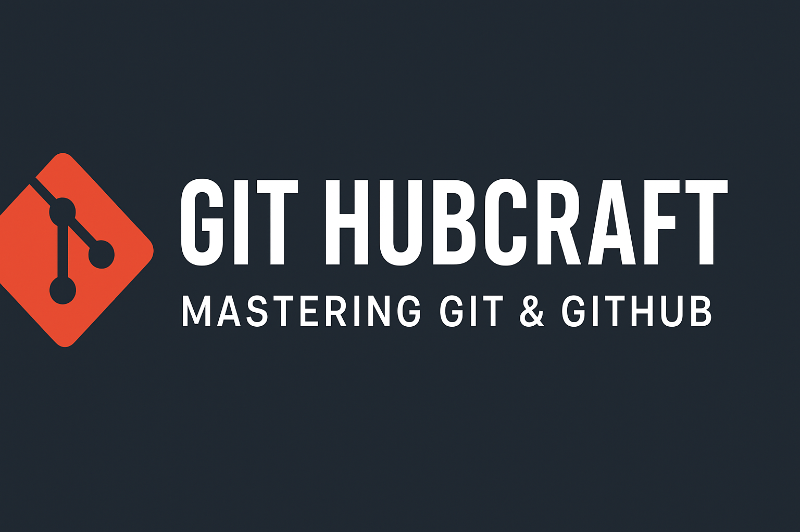

<p align="center">
  
</p>

<h1 align="center">🛠️ Git Hubcraft</h1>

<p align="center">
  <strong>A comprehensive guide to mastering Git & GitHub</strong>
</p>

<p align="center">
  <!-- Badges -->
  <a href="https://github.com/hetfs/git-hubcraft/stargazers">
    
  </a>
  <a href="https://github.com/hetfs/git-hubcraft/issues">
    
  </a>
  <a href="https://github.com/hetfs/git-hubcraft/blob/main/LICENSE">
    
  </a>
  <a href="https://git-scm.com/">
    
  </a>
</p>

---

**Git Hubcraft** is a comprehensive learning resource designed to help you **master Git and GitHub** from the fundamentals of version control to advanced collaboration workflows, history rewriting, and automation with GitHub Actions.

Whether you’re a beginner learning the basics or a professional developer refining your workflow, **Git Hubcraft** equips you with the knowledge to craft efficient, reliable, and scalable version control practices.

---

## 📚 What You’ll Learn

* **Git Fundamentals**: installation, setup, configuration, and essential commands.
* **Branching & Merging**: branch strategies, merge workflows, rebasing, and conflict resolution.
* **GitHub Collaboration**: pull requests, code reviews, branching models, and team best practices.
* **Advanced Git**: reflog, reset, bisect, cherry-pick, submodules, and hooks.
* **Git Internals**: how Git stores data: objects, refs, trees, and packfiles.
* **Automation**: CI/CD workflows with GitHub Actions.

---

## 🚀 Getting Started

### 1. Clone the Repository
```bash
git clone https://github.com/hetfs/git-hubcraft.git
cd git-hubcraft
````

### 2. Install Dependencies

```bash
npm install
```

### 3. Run Documentation Locally

```bash
npm run start
```

This launches the **Docusaurus-powered documentation site** for Git Hubcraft.

---

## 📖 Documentation Structure

* **Introduction** → Why Git & GitHub matter
* **Git Basics** → Config, commits, staging, undoing mistakes
* **Branching & Merging** → Branching strategies, workflows
* **GitHub Collaboration** → Pull requests, issues, reviews
* **Advanced Git** → Rewriting history, bisect, submodules, hooks
* **Internals** → Low-level Git objects & storage
* **Automation** → CI/CD pipelines with GitHub Actions

---

## 🤝 Contributing

Contributions are welcome! Here’s how to get involved:

1. **Fork** the repository.
2. **Create** a new branch:

   ```bash
   git checkout -b feature/my-feature
   ```
3. **Commit** your changes with clear messages.
4. **Push** to your fork and open a Pull Request.

Please follow the [Code of Conduct](./CODE_OF_CONDUCT.md) when contributing.

---

## 📜 License

This project is licensed under the **MIT License** — see the [LICENSE](./LICENSE) file for details.

---

## 🌐 Roadmap

* [ ] Core Git tutorials (basics → advanced)
* [ ] GitHub workflows & collaboration
* [ ] Git internals deep dive
* [ ] GitHub Actions automation examples
* [ ] Interactive examples & challenges

---

> ✨ *Git Hubcraft is not just about commands — it’s about mastering the craft of version control and collaboration.*
