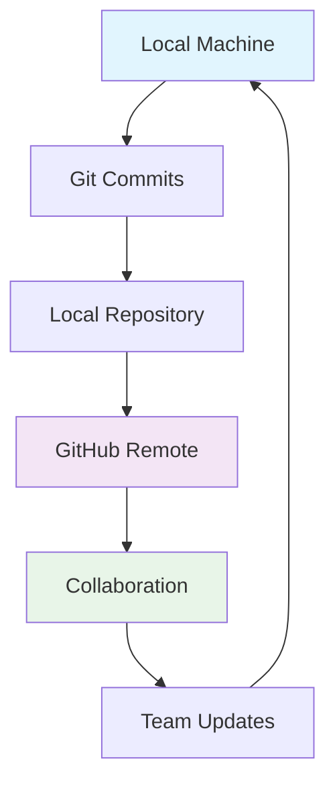

# Git and GitHub

## 🎯 Understanding the Difference

### Git: The Version Control System
**Git** is a **distributed version control system** that runs locally on your computer. It tracks changes to your code over time, allowing you to:

- Save different versions of your projects
- Collaborate with others without overwriting work
- Experiment with new features safely
- Revert to previous states if something breaks

### GitHub: The Collaboration Platform
**GitHub** is a **cloud-based hosting service** built around Git. It provides:

- Remote storage for your Git repositories
- Collaboration tools (pull requests, issues, discussions)
- Project management features
- CI/CD pipelines and automation
- Social coding community

---

## 🏗️ How They Work Together



### The Basic Workflow
1. **Local Development**: Use Git to track changes on your computer
2. **Backup & Share**: Push your code to GitHub for safekeeping
3. **Collaborate**: Use GitHub features to work with others
4. **Sync**: Pull changes from GitHub to stay up-to-date

---

## 🛠️ Core Git Concepts

### Repository (Repo)
A **repository** is your project's folder that Git tracks. It contains:
- Your project files
- Complete history of all changes
- Configuration data

```bash
# Initialize a new Git repository
git init

# Clone an existing repository
git clone https://github.com/user/repo.git
```

### Commits
**Commits** are snapshots of your project at specific points in time. Each commit has:
- Unique ID (hash)
- Author information
- Timestamp
- Commit message describing the changes

```bash
# Stage changes for commit
git add filename.txt

# Create a commit with message
git commit -m "Add user authentication feature"
```

### Branches
**Branches** allow you to work on different features simultaneously without affecting the main codebase.

```bash
# Create and switch to new branch
git checkout -b feature/new-feature

# List all branches
git branch

# Switch between branches
git checkout main
```

### Merging
**Merging** combines changes from different branches together.

```bash
# Merge feature branch into main
git checkout main
git merge feature/new-feature
```

---

## 🌐 GitHub Features

### Remote Repositories
Store your code in the cloud and collaborate with others.

```bash
# Add GitHub as remote origin
git remote add origin https://github.com/user/repo.git

# Push local changes to GitHub
git push -u origin main

# Pull changes from GitHub
git pull origin main
```

### Pull Requests
**Pull requests** are GitHub's way of proposing and reviewing changes before merging them.

**Benefits:**
- Code review and discussion
- Automated testing
- Continuous integration
- Knowledge sharing

### Issues & Project Management
Track tasks, enhancements, and bugs:
- **Issues**: Bug reports and feature requests
- **Projects**: Kanban-style task boards
- **Milestones**: Group issues by goals
- **Labels**: Categorize and filter issues

### GitHub Actions
Automate your workflow with CI/CD pipelines:
- Run tests automatically
- Deploy to production
- Build and package applications
- Execute scheduled tasks

---

## 🚀 Common Workflows

### Individual Developer
```bash
# Daily workflow for solo projects
git add .                          # Stage changes
git commit -m "Describe changes"   # Commit locally
git push origin main              # Backup to GitHub
```

### Team Collaboration
```bash
# Team workflow with feature branches
git checkout -b feature/awesome-feature  # Create feature branch
git add .                                # Stage changes
git commit -m "Implement feature"        # Commit work
git push origin feature/awesome-feature  # Push to GitHub
# Then create Pull Request on GitHub for review
```

### Open Source Contribution
```bash
# Contributing to others' projects
git fork https://github.com/owner/repo.git  # Fork on GitHub
git clone https://github.com/you/repo.git   # Clone your fork
git checkout -b fix-bug                     # Create fix branch
# Make changes, commit, push, then create PR to original repo
```

---

## 📊 Git vs GitHub Comparison

| Aspect | Git | GitHub |
|--------|-----|---------|
| **Type** | Version Control System | Web-based Platform |
| **Location** | Local on your machine | Cloud-based service |
| **Installation** | Required on each machine | Accessed via browser |
| **Cost** | Free and open-source | Free for public repos, paid for private |
| **Primary Use** | Tracking code changes | Collaboration and hosting |
| **Key Features** | Commits, branches, merging | Pull requests, issues, projects |

---

## 💡 Best Practices

### Git Best Practices
- **Write clear commit messages** in imperative tense
  - ✅ "Add user authentication"
  - ❌ "Added user authentication"
- **Commit often, push regularly**
- **Use feature branches** for new work
- **Keep commits focused** on single logical changes

### GitHub Best Practices
- **Use descriptive branch names**
  - ✅ `feature/user-auth`, `fix/login-bug`
  - ❌ `new-stuff`, `fixes`
- **Write good PR descriptions**
- **Use issues for tracking**
- **Protect your main branch**

### Security Practices
- **Use SSH keys** for authentication
- **Enable two-factor authentication**
- **Review code carefully** before merging
- **Use branch protection rules**

---

## 🎯 Getting Started

### 1. Install Git
```bash
# macOS with Homebrew
brew install git

# Ubuntu/Debian
sudo apt install git

# Windows
# Download from git-scm.com
```

### 2. Configure Git
```bash
git config --global user.name "Your Name"
git config --global user.email "your.email@example.com"
```

### 3. Create GitHub Account
- Visit [github.com](https://github.com)
- Sign up for free account
- Verify your email address

### 4. Your First Repository
```bash
# Create new project folder
mkdir my-project
cd my-project

# Initialize Git
git init

# Create and commit first file
echo "# My Project" > README.md
git add README.md
git commit -m "Initial commit"

# Connect to GitHub (create repo on GitHub first)
git remote add origin https://github.com/username/repo.git
git push -u origin main
```

---

## 🔧 Essential Commands Cheat Sheet

### Local Development
```bash
git status                      # Check repository status
git add <file>                  # Stage specific file
git add .                       # Stage all changes
git commit -m "message"         # Commit changes
git log                         # View commit history
git diff                        # See uncommitted changes
```

### Branch Management
```bash
git branch                      # List branches
git branch <name>               # Create new branch
git checkout <branch>           # Switch branches
git merge <branch>              # Merge branches
git branch -d <branch>          # Delete branch
```

### GitHub Interaction
```bash
git clone <url>                 # Download repository
git push                        # Upload changes
git pull                        # Download updates
git fetch                       # Check for updates
git remote -v                   # View remote connections
```

---

## 🆘 Common Issues & Solutions

### Authentication Problems
```bash
# Use SSH instead of HTTPS
git remote set-url origin git@github.com:user/repo.git

# Or use personal access tokens
git remote set-url origin https://token@github.com/user/repo.git
```

### Merge Conflicts
1. **Identify conflicting files**: `git status`
2. **Edit files** to resolve conflicts (look for `<<<<<<<`, `=======`, `>>>>>>>`)
3. **Mark as resolved**: `git add <file>`
4. **Complete merge**: `git commit`

### Lost Changes
```bash
# Recover deleted branch
git reflog
git checkout -b <branch> <commit-hash>

# Undo local changes
git checkout -- <file>          # Discard file changes
git reset --hard HEAD          # Discard all uncommitted changes
```

---

## 🚀 Next Steps

### Learn More Git
- **Advanced branching strategies** (GitFlow, GitHub Flow)
- **Interactive rebasing** for clean history
- **Git hooks** for automation
- **Submodules** for managing dependencies

### Explore GitHub Features
- **GitHub Projects** for task management
- **GitHub Actions** for automation
- **GitHub Pages** for hosting websites
- **GitHub Codespaces** for cloud development

### Practice Resources
- [Git](https://git-scm.com/about/branching-and-merging)
- [Oh My Git!](https://ohmygit.org/) (game)

---

## 💬 Summary

- **Git** = Local version control on your machine
- **GitHub** = Cloud platform for collaboration and hosting
- **Together** = Powerful workflow for individual and team development

Git tracks your changes, GitHub shares them with the world. Master both to become a more effective developer!

> **Remember**: Git is the engine, GitHub is the car. You need both to go places in modern software development.
